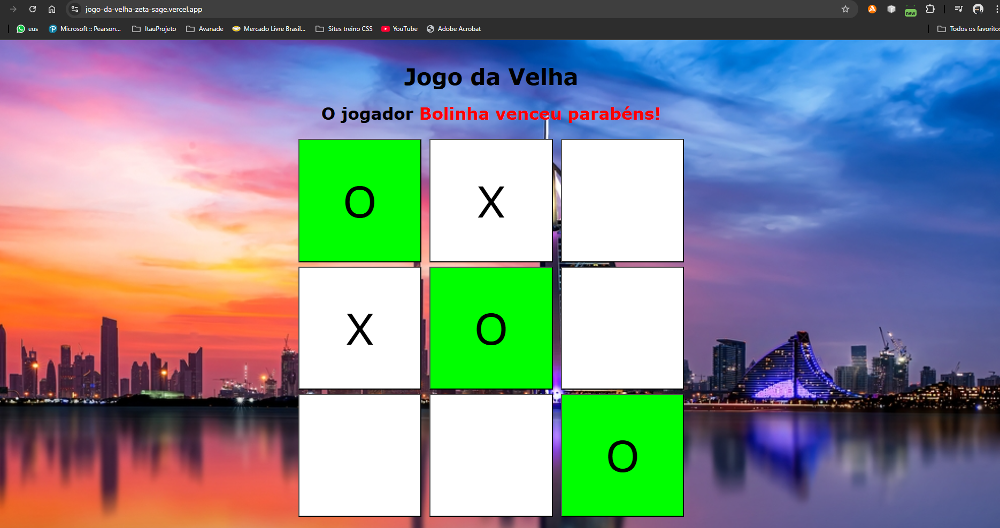

# Resumo do projeto
- Nesse projeto foi criado o jogo da velha , onde dois jogadores vai selecionando cada card e assim que um deles acumula uma linha de 3 itens iguais vence o jogo.

## Tecnologias usadas
- HTML
- CSS
- Javascript

